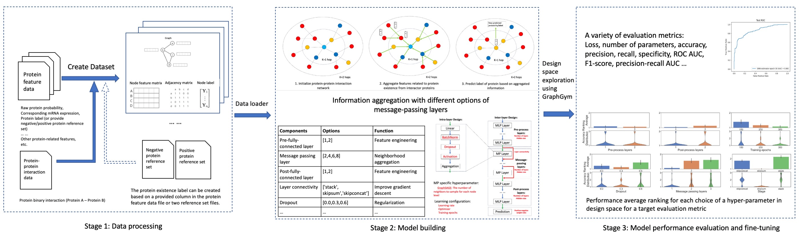

# Welcome to GrapePi: Graph neural network using Protein-protein-interaction for Enhancing Protein Identification

<p align="center">
  
</p>

# Introduction

GRAph-neural-network using Protein-protein-interaction for Enhancing Protein Identification (Grape-Pi) is a deep
learning framework for predict protein existence based on
protein feature generated from Mass spectrometry (MS) instrument/analysis software and protein-protein-interaction (PPI)
network.

The main idea is to promote proteins with medium evidence but are supported by protein-protein-interaction information
as existent. Unlike traditional network analysis, PPI information is used with strong assumptions and restricted to
specific sub-network structures (e.g. clique), Grape-Pi model is a fully data-driven model and can be much more
versatile.

--------------------------------------------------------------------------------

The contribution of Grape-Pi comes in threefold. First, we developed 
a dataloader module designed for loading MS protein data and 
protein-protein-interaction data into dataset format that can be readily
used by torch-geometry. Second, we customized the graphgym module
for the purpose of supervised learning in proteomics data. Third, we
explored the design space and discussed caveats for training such a 
model for the best performance.


# installation
**GrapePi** is built on top of the **PyTorch Geometric**, a geometric 
deep learning extension library for PyTorch. 
It consists of various methods for deep learning on graphs and
other irregular structures, also known as *[geometric deep learning](http://geometricdeeplearning.com/)*, from a 
variety of published papers.
In addition, it consists of easy-to-use mini-batch loaders for operating on many small and single giant
graphs, [multi GPU-support](https://github.com/pyg-team/pytorch_geometric/tree/master/examples/multi_gpu), [`DataPipe` support](https://github.com/pyg-team/pytorch_geometric/blob/master/examples/datapipe.py),
distributed graph learning via [Quiver](https://github.com/pyg-team/pytorch_geometric/tree/master/examples/quiver), a
large number of common benchmark datasets (based on simple interfaces to create your own),
the [GraphGym](https://pytorch-geometric.readthedocs.io/en/latest/advanced/graphgym.html) experiment manager, and
helpful transforms, both for learning on arbitrary graphs as well as on 3D meshes or point clouds.

## Create a virtual environment
It is highly recommended to use a virtual environment to install the required packages for Grape-Pi.
Please refer to https://conda.io/projects/conda/en/latest/user-guide/install/index.html for how to install a miniconda
or anaconda in your local machine.

To create a virtual environment, for example, if using conda
```angular2html
conda create -n [Name-of-the-Virtual-Environment] python=3.10
conda activate [Name-of-the-Virtual-Environment]
```
Replace `[Name-of-the-Virtual-Environment]` with your preferred name.


##  Get a copy of the project
Clone a copy of Grape-Pi from source and navigate to the root directory of the download folder. See [Cloning a repository](https://docs.github.com/en/repositories/creating-and-managing-repositories/cloning-a-repository) for more details about how to make a local copy of project.

```angular2html
git clone https://github.com/FDUguchunhui/GrapePi.git
cd GrapePi
```

## Install dependencies
The dependencies for Grape-Pi project are listed in the `requirements.txt` file. To install the dependencies, run
```angular2html
cd GrapePi # navigate to the root directory of the project
pip install -r requirements.txt
```

`pyproject.toml` is a new standard file for declare dependencies and build system information for Python projects. You can also use poetry to install the dependencies. 
See more at [Poetry](https://python-poetry.org/docs/basic-usage/)
```azure
cd GrapePi # navigate to the root directory of the project
conda install poetry
poetry install --no-root
```

Some package may not be installed correctly, you may need to install them manually, including torch, torch_geometric,
and others packages that torch and torch_geometric depends. Those packages depend on the version of python and 
pytorch, architecture of the system, and operating system. Follow the instruction below to install the required 
packages based on your environment.

The original torch-geometry support python 3.7-3.11 with pytorch 1.3.0-2.0.0. For illustration purpose, we use python=3.10 and pytorch=2.0.0 here.
For using and debugging with other python and pytorch version, please refer
to https://github.com/pyg-team/pytorch_geometric for details


### Install pytorch

For mac
```angular2html
conda install pytorch==2.0.0 torchvision==0.15.0 torchaudio==2.0.0 -c pytorch
```

For Linux and Windows:

```angular2html
# CUDA 11.8
conda install pytorch==2.1.0 torchvision==0.16.0 torchaudio==2.1.0 pytorch-cuda=11.8 -c pytorch -c nvidia
# CUDA 12.1
conda install pytorch==2.1.0 torchvision==0.16.0 torchaudio==2.1.0 pytorch-cuda=12.1 -c pytorch -c nvidia
# CPU Only
conda install pytorch==2.1.0 torchvision==0.16.0 torchaudio==2.1.0 cpuonly -c pytorch
```

Follow the installation instructions to install additional libraries to using Grape-Pi:

torch-scatter, torch-sparse, torch-cluster and torch-spline-conv (if you haven't already). Replace {CUDA} with your 
specific CUDA version or cpu.
```angular2html
pip install torch_scatter torch_sparse torch_cluster torch_spline_conv -f https://data.pyg.org/whl/torch-2.1.0+${CUDA}.html
```

If you are using pytorch=2.1.0 cpu only version, run
```angular2html
pip install torch_scatter torch_sparse torch_cluster torch_spline_conv -f https://data.pyg.org/whl/torch-2.1.0+cpu.html
```


## Quick start

### Use pre-trained model to make prediction
```angular2html
python grape_pi.py --cfg data/gastric_all_data/gastric-graphsage.yaml --checkpoint saved_results/gastric-graphsage/epoch=199-step=4800.ckpt --threshold 0.9 --num-promoted 100
```
The above command will initialize the model that is defined in provided configuration files and  load the trained model from the checkpoint 
file, make prediction on the unconfident proteins, 
which are defined as proteins with raw protein probability below 0.9 and without any groud-truth label, and promote 
100 proteins with the highest prediction protein probability. The prediction result "promoted_protein.csv" will be 
saved in the root directory of the provided data path. You can change the **dataset.dir** in the configuration file 
to the path of your own data to make prediction on your own data. 

You can also overwrite data path by providing 
additional argument in key and value format sequentially after the command. For example,
```angular2html
python grape_pi.py ---cfg data/gastric_all_data/gastric-graphsage.yaml --checkpoint 
saved_results/gastric-graphsage/epoch=199-step=4800.ckpt --threshold 0.9 --num-promoted 100 dataset.dir {YOUR_DATA_PATH}
```
Replace `{YOUR_DATA_PATH}` with the path of your own data. Using this approach you can override any key-value pair 
related to model training in configuration file without changing the configuration file.

For the best performance, it is recommended to train a new model with your own data. To train a new model, you just 
need to run the same command without the `--checkpoint` argument.
You can use the following command to train a new model with your own data. It will use predefined configuration file,
which use "sageConv" as the 
message-passing layer and hyperparameters that have been optimized for this task. Once the training is done, it will 
be saved in the `results` folder by default. Go into the `results` folder, you can find a subfolder name after the 
configuration file name, the ckpt file will be saved in this subfolder under "{random_seed}/ckpt" folder, where 
{random_seed} is the random seed used for this training. 
```angular2html
### Train a new model with given hyper-parameters options
python grape_pi.py ---cfg data/gastric_all_data/gastric-graphsage.yaml --threshold 0.9 --num-promoted 100
```
See more details about the format of the `protein` and `protein interaction`. You can also change the 
hyperparameters in the configuration file to optimize the model for your own data once you have a better 
understanding about what each hyperparameter does.

## GrapePi training framework

The complete GrapePi training framework consists of three main components: data preparation, hyperparameter training, 
and post-training analysis.

### Data preparation
The GraphPi training framework was based on graphgym. Please check `Design Space for Graph Neural Networks
https://arxiv.org/abs/2011.08843` for details.

The GraphPi framework features a built-in module for easily load raw 
protein and PPI data into torch.geometry.dataset
format that can be used for training model. The only things needed is to 
provide a path to the dataset folder.

The dataset folder structure should look like this, with a sub-folder 
named `raw` inside the `raw` sub-folder, it should have three
sub-folders: protein, interaction, and reference (optional).

The  `protein`  folder must contain exact only one **csv** file: 
the first column and second column must be protein ID and raw protein probability, and other columns can contain additional protein features.

The `interaction` folder must contain exact only one **csv** file: the first 
and second columns must be same type protein ID (e.g. Uniprot 
accession number or gene symbol) refer to the two protein interactors,
other columns can be additional features for the interaction relationship. The ID system used should be matched with 
the protein ID in the `protein` folder.

You have two options to provide ground-truth labels for the protein existence in the sample. First, you can provide 
the ground-true label in the `protein` csv file, you will need to specify the column name of the ground-true label 
through `dataset.label_column` in config file (more details later). Second, you can provide a reference folder, which contains two txt files:`positive. txt` and 
`negative.txt`. The reference folder will be ignored if `dataset.label_column` is specified in the config file. 

If you decide to use`Reference` folder to create **ground-truth** label, it must contain two txt files. `positive. txt` and `negative. txt`. Those are two simple txt 
file with a protein ID in each line. The protein in 
`positive.txt` will be used to create positive label in the final processed 
dataset. The protein in `negative.txt` will be used to create negative
label in the final processed dataset. Protein that is not found in either
`positive.txt` and `negative.txt` will be treated as unlabeled.
Only labeled proteins will be used for model training, loss calculation, and then 
backward propagation to update model.

You could find such an example using `reference` to create protein existence label, in dataset 
`Graph-Pi/graphgym/data/yeast`

### Set up model configuration
Before you can train a model based on the provided data, a configuration file is needed to for some key information:
where to find the data, how to parse the data, what features to use, model structure, what loss function to use, how to
update model weights, etc.

You could find such an example of such config `Graph-Pi/graphgym/config/protein/protein-yeast-graphsage.yaml`

```ymal
out_dir: results # output will be put in graphgym/results
metric_best: auc # best model will be selected based on what
dataset: # need to delete the `processed` folder if change args under dataset category
  name: protein # specify what dataloader used
  dir: ./data/yeast
  numeric_params: # currently, only numeric protein features are allowed
  - protein probability
  - percent coverage
  - tot indep spectra
  - percent share of spectrum ids
  task: node
  task_type: classification
  transductive: false
  transform: none
  encoder: false
  node_encoder: false
  edge_encoder: false
  split: [0.8, 0.1, 0.1]
share:
  dim_in: -1      # `-1` means the input dim will be determined automatically
  dim_out: 2
train:
  loss_pos_weight: -1.0  # `-1` means sample will be automatically rebalanced using sklearn.utils.class_weight.compute_class_weight
  batch_size: 128 # number of nodes used in each iteration
  eval_period: 10 # evaluate model in val and test dataset every 10 epochs
  ckpt_period: 10 # save model after every 10 epochs training
  ckpt_clean: false
  sampler: neighbor # use `neighor` for sampler for layer_type=sageconv
  neighbor_sizes: # the number of nodes sampled in each neighor level
  - 100
  - 50
  - 25
  - 10
  epoch_resume: -1
model:
  type: gnn
  loss_fun: binary_cross_entropy_with_weight
gnn:
  layers_pre_mp: 1
  layers_mp: 2
  layers_post_mp: 1
  dim_inner: 8 # 2 * dim_in
  layer_type: sageconv
  stage_type: stack # other available: skipsum, skipconcat
  batchnorm: false
  act: relu
  dropout: 0.0
  normalize_adj: false
  head: protein
optim:
  optimizer: adam
  base_lr: 0.001
  weight_decay: 5e-4  # L2 penalty
  max_epoch: 100
  scheduler: none
```

During the programming first running, a new "processed" folder will create under the provided data folder which stores
the
converted torch_geometry.data.dataset format and additional processed files. This allows a one-time processing and the
next time data the same data is used, the processed file will be loaded directly to save time.

**Caution**: In case you have updated the raw files, you need to manually deleted the entire `processed` folder to let
the program
rebuild processed data from modified raw files.

The instruction above only aim to provide a start point for user to check how we did our experiment.
Please refer to https://github.com/snap-stanford/GraphGym for more details about how to config a batch experiment.

### Set up batch experiment

Batch experiment allow user to run multiple experiments with different hyper-parameters in sequential with or without
parallel. To run a batch experiment, you need to provide three configuration files. The first configuration file is the
model configuration file as described above. The second configuration file is the grid search configuration file which
specify the hyper-parameters to be searched. The third configuration file is the batch experiment configuration file
which
specify the batch experiment setting such as how many times to repeat the experiment, how many jobs to run in parallel,
etc.

### Set up grid search configuration

Grid search configuration file is a text file with each row specify a hyper-parameter to be searched. The first column
is the name of the hyper-parameter in the model configuration file, the second column is the alias of the
hyper-parameter
which will be used in the output file name, the third column is the range of the hyper-parameter to be searched.

```angular2html
# Format for each row: name in config.py; alias; range to search
# No spaces, except between these 3 fields
# Line breaks are used to union different grid search spaces
# Feel free to add '#' to add comments

gnn.dropout drop [0.0,0.3,0.6]
gnn.layers_pre_mp l_pre [1,2]
gnn.layers_mp l_mp [1,2,3]
gnn.layers_post_mp l_post [1,2]
gnn.stage_type stage ['stack','skipsum','skipconcat']
optim.max_epoch epoch [100,200,300]
train.ckpt_clean ckpt_clean [True]
```

### setup batch experiment additional configuration

Batch experiment additional configuration file is a bash file with each row specify a bash variable to be used in the
batch experiment. The first parameter `CONFIG` is the name of the model configuration file (expect to find it under
`configs/protein/` folder. The second parameter `GRID` is the name of the grid search configuration file (expect to find
it under `grids` folder. The third parameter `REPEAT` is the number of times to repeat the experiment. The fourth
parameter
`MAX_JOBS` is the number of jobs to run in parallel. The fifth parameter `SLEEP` is the time to sleep between each job.
The sixth parameter `MAIN` is the name of the main python file to execute each experiment.

```angular2html
CONFIG=${CONFIG:-protein-yeast-gcnconv}
GRID=${GRID:-protein-yeast-gcnconv}
REPEAT=${REPEAT:-3}
MAX_JOBS=${MAX_JOBS:-1}
SLEEP=${SLEEP:-0}
MAIN=${MAIN:-main}

# generate configs (aft
# er controlling computational budget)
# please remove --config_budget, if don't control computational budget
python configs_gen.py --config configs/protein/${CONFIG}.yaml \
  --grid grids/${GRID}.txt \
  --out_dir configs
#python configs_gen.py --config configs/ChemKG/${CONFIG}.yaml --config_budget configs/ChemKG/${CONFIG}.yaml --grid grids/ChemKG/${GRID}.txt --out_dir configs
# run batch of configs
# Args: config_dir, num of repeats, max jobs running, sleep time
bash parallel.sh configs/${CONFIG}_grid_${GRID} $REPEAT $MAX_JOBS $SLEEP $MAIN
# rerun missed / stopped experiments
bash parallel.sh configs/${CONFIG}_grid_${GRID} $REPEAT $MAX_JOBS $SLEEP $MAIN
# rerun missed / stopped experiments
bash parallel.sh configs/${CONFIG}_grid_${GRID} $REPEAT $MAX_JOBS $SLEEP $MAIN

# aggregate results for the batch
python agg_batch.py --dir results/${CONFIG}_grid_${GRID}
```

### run batch experiment

```angular2html
bash run_batch_yeast_gcnconv.sh
```

### Aggregate results
Run `bash run_batch_yeast_gcnconv.sh` should automatically aggregate batch experiment result into `agg` folder.
However, in case it is not generated automatically, you can manually aggregate the results by run

```angular2html 
python agg_batch.py --dir results/protein-yeast-graphsage_grid_protein-yeast-graphsage
```

## Cite

Please cite the following papers if you use this code in your own work::
[Fast Graph Representation Learning with PyTorch Geometric

[Fast Graph Representation Learning with PyTorch Geometric
](https://arxiv.org/abs/1903.02428)

```
@inproceedings{Fey/Lenssen/2019,
  title={Fast Graph Representation Learning with {PyTorch Geometric}},
  author={Fey, Matthias and Lenssen, Jan E.},
  booktitle={ICLR Workshop on Representation Learning on Graphs and Manifolds},
  year={2019},
}
```

Common issues:

1. If you have the following problem during processing the `raw` data into `processed` data

```angular2html
utf8' codec can't decode byte 0x80 in position 3131: invalid start byte
```

This is caused by a hidden `.DS_Store` file created by the Mac OS system
Use terminal enter the `protein` folder under the `raw` folder

```angular2html
ls -a # check if there is a .DS_Store file
rm .DS_Store # remove the file
rm -r ../../processed # remove the ill-created `processed` data
```

2. Mac user may encounter the following problem

```angular2html
/Users/guchunhui/Documents/GNN-PPI/torch_geometric/typing.py:25: UserWarning: An issue occurred while importing 'pyg-lib'. Disabling its usage. Stacktrace: dlopen(/Users/guchunhui/opt/anaconda3/envs/Grape-Pi/lib/python3.10/site-packages/libpyg.so, 0x0006): Library not loaded: '/Users/runner/hostedtoolcache/Python/3.10.8/x64/lib/libpython3.10.dylib'
  Referenced from: '/Users/guchunhui/opt/anaconda3/envs/Grape-Pi/lib/python3.10/site-packages/libpyg.so'
  Reason: tried: '/Users/runner/hostedtoolcache/Python/3.10.8/x64/lib/libpython3.10.dylib' (no such file), '/usr/local/lib/libpython3.10.dylib' (no such file), '/usr/lib/libpython3.10.dylib' (no such file)
  warnings.warn(f"An issue occurred while importing 'pyg-lib'. "
/Users/guchunhui/Documents/GNN-PPI/torch_geometric/typing.py:76: UserWarning: An issue occurred while importing 'torch-sparse'. Disabling its usage. Stacktrace: dlopen(/Users/guchunhui/opt/anaconda3/envs/Grape-Pi/lib/python3.10/site-packages/libpyg.so, 0x0006): Library not loaded: '/Users/runner/hostedtoolcache/Python/3.10.8/x64/lib/libpython3.10.dylib'
  Referenced from: '/Users/guchunhui/opt/anaconda3/envs/Grape-Pi/lib/python3.10/site-packages/libpyg.so'
  Reason: tried: '/Users/runner/hostedtoolcache/Python/3.10.8/x64/lib/libpython3.10.dylib' (no such file), '/usr/local/lib/libpython3.10.dylib' (no such file), '/usr/lib/libpython3.10.dylib' (no such file)
  warnings.warn(f"An issue occurred while importing 'torch-sparse'. "
```

The solution is to run the following

```angular2html
pip uninstall pyg_lib
```

Source: https://github.com/pyg-team/pyg-lib/issues/217

3. If you see the following error during batch training, it means there is no enough system resources to performance
   such
   a batch training. Please be aware of the multiplication of `num_workers` in model configuration file and `MAX_JOBS`
   in
   parallel.sh should not exceed the total number of workers (threads) available in the system. For example, if
   `num_workers`: 2 and MAX_JOBS=${MAX_JOBS:-6} will raise error in a computer with only 8 cpu threads.

```angular2html
Sanity Checking: 0it [00:00, ?it/s]Traceback (most recent call last):
  File "/home/user/miniconda3/envs/grape-pi/lib/python3.10/multiprocessing/queues.py", line 244, in _feed
  File "/home/user/miniconda3/envs/grape-pi/lib/python3.10/multiprocessing/reduction.py", line 51, in dumps
  File "/home/user/miniconda3/envs/grape-pi/lib/python3.10/site-packages/torch/multiprocessing/reductions.py", line 369, in reduce_storage
RuntimeError: user open shared memory object </torch_2070_3445168708_503> in read-write mode: Too many open files (24)
Traceback (mosusercall last):
  File "/home/user/miniconda3/envs/grape-pi/lib/python3.10/multiprocessing/queues.py", line 244, in _feed
  File "/home/user/miniconda3/envs/grape-pi/lib/python3.10/multiprocessing/reduction.py", line 51, in dumps
  File "/home/user/miniconda3/envs/grape-pi/lib/python3.10/site-packages/torch/multiprocessing/reductions.py", line 370, in reduce_storage
  File "/home/user/miniconda3/envs/grape-pi/lib/python3.10/multiprocessing/reduction.py", line 198, in DupFd
  File "/home/user/miniconda3/envs/grape-pi/lib/python3.10/multiprocessing/resource_sharer.py", line 48, in __init__
OSError: [Errno 24] Too many open files
```

4.For Mac Apple M1/M2 user, you may encounter the following error when try Grape-Pi-SAGEConv model

```angular2html
Intel MKL FATAL ERROR: This system does not meet the minimum requirements for use of the Intel(R) Math Kernel Library.
The processor must support the Intel(R) Supplemental Streaming SIMD Extensions 3 (Intel(R) SSSE3) instructions.
The processor must support the Intel(R) Streaming SIMD Extensions 4.2 (Intel(R) SSE4.2) instructions.
The processor must support the Intel(R) Advanced Vector Extensions (Intel(R) AVX) instructions.
```

Try to install the following package.

```angular2html
conda install -y clang_osx-arm64 clangxx_osx-arm64 gfortran_osx-arm64
```

Find more details, please refer to https://github.com/rusty1s/pytorch_scatter/issues/241