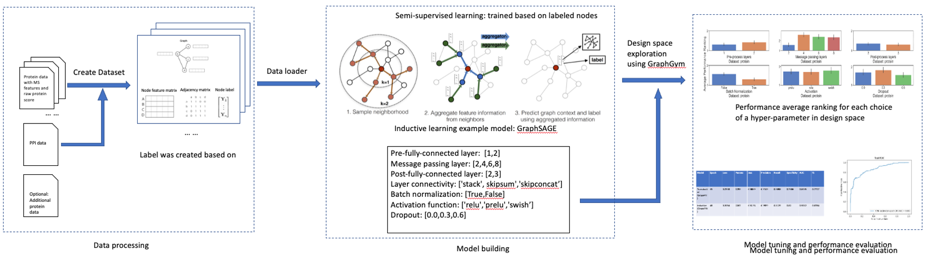

# Graph neural network using Protein-protein-interaction for Enhancing Protein Identification (Grape-Pi)

## Introduction
GRAph-neural-network using Protein-protein-interaction for Enhancing Protein Identification (Grape-Pi) is a deep 
learning framework for predict protein existence based on
protein feature generated from Mass spectrometry (MS) instrument/analysis software and protein-protein-interaction (PPI)
network.

The main idea is to  promote proteins with medium evidence but are supported by protein-protein-interaction information
as existent. Unlike traditional network analysis, PPI information is used with strong assumptions and restricted to
specific sub-network structures (e.g. clique), Grape-Pi model is a fully data-driven model and can be much more versatile. 

The framework was built on top of torch-geometry and pytorch library. GraphyGym is used for allowing model training with a
variety of hyperparameter combination with less computation and time using the idea of random-design-space searching and 
parallel computing. See Design Space for Graph Neural Networks: https://arxiv.org/abs/2011.08843 for more details.

The contribution of Grape-Pi comes in threefold. First, we developed a dataloader module designed for loading MS protein
data and protein-protein-interaction data into dataset format that can be readily used by torch-geometry.
Second, we customized the graphgym module for the purpose of unsupervised learning in proteomics data. Third, we explored
the design space and discussed caveats for training such a model for the best performance.


## installation

### Create virtual environment
Due to special training infrastructure requirement, we modified part of code in the torch_geometric package. Therefore,
to run the code, the customized torch_geometric package must be used instead of an official version of torch_geometric
package. We recommend use `conda` or other tools to create a virtual environment to avoid unexpected errors when running 
code that requires a official version of torch_geometric package.

Please refer to https://conda.io/projects/conda/en/latest/user-guide/install/index.html for how to install a miniconda
or anaconda in your local machine.

To create a virtual environment, for example, if using conda
```angular2html
conda create -n [Name-of-the-Virtual-Environment] python=3.7
conda activate [Name-of-the-Virtual-Environment]
```
Replace `[Name-of-the-Virtual-Environment]` with your preferred name.

The original torch-geometry support python 3.7-3.11 with pytorch 1.3.0-2.0.0. For illustration
purpose, we use python=3.7 and pytorch=1.13.0 here. 
For using and debugging with other python and pytorch version, please refer to https://github.com/pyg-team/pytorch_geometric for details

In case you have accidentally an official version of torch-geometric, run
```angular2html
pip uninstall torch-geometric
pip uninstall torch-geometric  # run this command twice
```

### Install pytorch
For mac
```angular2html
conda install pytorch==1.13.0 torchvision==0.14.0 torchaudio==0.13.0 -c pytorch
```
For Linux and Windows:
```angular2html
# CUDA 11.6
conda install pytorch==1.13.0 torchvision==0.14.0 torchaudio==0.13.0 pytorch-cuda=11.6 -c pytorch -c nvidia
# CUDA 11.7
conda install pytorch==1.13.0 torchvision==0.14.0 torchaudio==0.13.0 pytorch-cuda=11.7 -c pytorch -c nvidia
# CPU Only
conda install pytorch==1.13.0 torchvision==0.14.0 torchaudio==0.13.0 cpuonly -c pytorch
```

### Follow the installation instructions to install additional libraries to using Grape-Pi:
torch-scatter, torch-sparse, torch-cluster and torch-spline-conv (if you haven't already):
```angular2html
pip install torch-scatter torch-sparse torch-cluster torch-spline-conv 
-f https://data.pyg.org/whl/torch-${TORCH}+${CUDA}.html
```
If you are using pytorch=1.13.0 cpu only version, run
```angular2html
pip install torch_scatter torch_sparse torch_cluster 
torch_spline_conv -f https://data.pyg.org/whl/torch-1.13.0+cpu.html
```

## If you follow the instruction above and use new virtual environment, you don't need to run this code chunk.
In case you have installed pyg-lib before from somewhere and run into unexpected error, try
uninstall pyg-lib to avoid that it conflicts with torch_sparse library.
```angular2html
pip uninstall pyg-lib
```


### Clone a copy of Grape-Pi from source and navigate to the root directory of the download folder
```angular2html
git clone https://github.com/FDUguchunhui/Grape-Pi.git
cd Grape-Pi
```

### Install Grape-Pi in editable mode:
```angular2html
pip install -e ".[dev,full]"
```


## Data preparation
The Graph-Pi training framework was based on graphgym. Please check `Design Space for Graph Neural Networks 
https://arxiv.org/abs/2011.08843` for details.

The Graph-Pi framework features a built-in module for easily load raw protein and PPI data into torch.geometry.dataset 
format that can be used for training model. The only things needed is to provide a path to the dataset
folder.

The dataset folder structure should look like this, with a sub-folder named `raw`
inside the `raw` sub-folder, it should have three sub-folders: protein, interaction, reference.

The `protein` folder must contain only one csv or tsv file: the first column must be protein ID and other columns
contains additional protein features.

The `interaction` folder must contain only one csv or tsv file: the first and second columns must be same type protein ID,
refer to the two protein interactors, other columns can be additional features for the interaction relationship.

The `reference` folder must contain two txt files. 
`positive.txt` and `negative.txt` are two simple txt file with a protein ID in each line.
The protein in `positive.txt` will be used to create positive label in the final processed dataset
The protein in `negative.txt` will be used to create negative label in the final processed dataset.
Protein that is not found in either `positive.txt` and `negative.txt` will be treated as unlabelled.
Only labelled proteins will be used for calculating loss and then backward propagation to update model.

You could find such an example of such dataset `Graph-Pi/graphgym/data/yeast`

```dir
dataset_folder
    raw
        protein
            xxxx.csv
        interaction
            xxxx.csv
        reference
            negative.txt
            positive.txt
```

## Set up model configuration
Before you can train a model based on the provided data, a configuration file is needed to for some key information:
where to find the data, how to parse the data, what features to use, model structure, what loss function to use, how to 
update model weights, etc. 

You could find such an example of such config `Graph-Pi/graphgym/config/protein/protein-yeast-graphsage.yaml`

```ymal
out_dir: results # output will be put in graphgym/results
metric_best: auc # best model will be selected based on what
dataset: # need to delete the `processed` folder if change args under dataset category
  name: protein # specify what dataloader used
  dir: ./data/yeast
  numeric_params: # currently, only numeric protein features are allowed
  - protein probability
  - percent coverage
  - tot indep spectra
  - percent share of spectrum ids
  task: node
  task_type: classification
  transductive: false
  transform: none
  encoder: false
  node_encoder: false
  edge_encoder: false
  split: [0.8, 0.1, 0.1]
share:
  dim_in: -1      # `-1` means the input dim will be determined automatically
  dim_out: 2
train:
  loss_pos_weight: -1.0  # `-1` means sample will be automatically rebalanced using sklearn.utils.class_weight.compute_class_weight
  batch_size: 128 # number of nodes used in each iteration
  eval_period: 10 # evaluate model in val and test dataset every 10 epochs
  ckpt_period: 10 # save model after every 10 epochs training
  ckpt_clean: false
  sampler: neighbor # use `neighor` for sampler for layer_type=sageconv
  neighbor_sizes: # the number of nodes sampled in each neighor level
  - 100
  - 50
  - 25
  - 10
  epoch_resume: -1
model:
  type: gnn
  loss_fun: binary_cross_entropy_with_weight
gnn:
  layers_pre_mp: 1
  layers_mp: 2
  layers_post_mp: 1
  dim_inner: 8 # 2 * dim_in
  layer_type: sageconv
  stage_type: stack # other available: skipsum, skipconcat
  batchnorm: false
  act: relu
  dropout: 0.0
  normalize_adj: false
  head: protein
optim:
  optimizer: adam
  base_lr: 0.001
  weight_decay: 5e-4  # L2 penalty
  max_epoch: 100
  scheduler: none
```


## Usage
Navigate to the graphgym directory
```
python main.py --cfg configs/protein/protein-yeast-graphsage.yaml --repeat 1
```

During the programming first running, a new "processed" folder will create under the provided data folder which stores the
converted torch_geometry.data.dataset format and additional processed files. This allows a one-time processing and the 
next time data the same data is used, the processed file will be loaded directly to save time.

**Caution**: In case you have updated the raw files, you need to manually deleted the entire `processed` folder to let the program
rebuild processed data from modified raw files.

```angular2html
python main.py --cfg configs/example.yaml --repeat 3
```

After the program is successfully running, it will output necessary log for this run.

If you see the message in the following chuck, it means the raw data hasn't been processed, and it is the first time
used for model training. If you fail to pass this step, it means you data folder provided doesn't fit the required format.
```angular2html
Processing...
Done!
```

The following chunk of output shows the model structure configured based on the configuration file
```angular2html
GraphGymModule(
  (model): GNN(
    (encoder): FeatureEncoder()
    (pre_mp): GeneralMultiLayer(
      (Layer_0): GeneralLayer(
        (layer): Linear(
          (model): Linear(4, 8, bias=True)
        )
        (post_layer): Sequential(
          (0): ReLU()
        )
      )
    )
    (mp): GNNStackStage(
      (layer0): GeneralLayer(
        (layer): SAGEConv(
          (model): SAGEConv(8, 8, aggr=mean)
        )
        (post_layer): Sequential(
          (0): ReLU()
        )
      )
      (layer1): GeneralLayer(
        (layer): SAGEConv(
          (model): SAGEConv(8, 8, aggr=mean)
        )
        (post_layer): Sequential(
          (0): ReLU()
        )
      )
    )
    (post_mp): ExampleNodeHead(
      (layer_post_mp): MLP(
        (model): Sequential(
          (0): Linear(
            (model): Linear(8, 1, bias=True)
          )
        )
      )
    )
  )
)
```

The following chunk of output shows the complete configuration used. Some of the settings only work when a specific model
configuration is used, such as `agg` only work when `layer_type` is `generalconv`. Some of the settings is only a
reminder of what type of the task is, such as `transductive`. Some of the settings are left as placeholder for later
implementation or customization. Thus, not all of those setting are actually applied.

The confuseness of configuration is inherited from original torch_geometry. For advanced user, we recommended you refer to
https://antoniolonga.github.io/Advanced_PyG_tutorials/posts/post2.html to learn what each setting means and how to use.
```angular2html
accelerator: cpu
benchmark: False
bn:
  eps: 1e-05
  mom: 0.1
cfg_dest: config.yaml
custom_metrics: []
dataset:
  cache_load: False
  cache_save: False
  dir: ./data/yeast
  edge_dim: 128
  edge_encoder: False
  edge_encoder_bn: True
  edge_encoder_name: Bond
  edge_message_ratio: 0.8
  edge_negative_sampling_ratio: 1.0
  edge_train_mode: all
  encoder: False
  encoder_bn: True
  encoder_dim: 128
  encoder_name: db
  format: PyG
  label_column: none
  label_table: none
  location: local
  name: protein
  node_encoder: False
  node_encoder_bn: True
  node_encoder_name: Atom
  numeric_params: ['protein probability', 'percent coverage', 'tot indep spectra', 'percent share of spectrum ids']
  remove_feature: False
  resample_disjoint: False
  resample_negative: False
  shuffle_split: True
  split: [0.8, 0.1, 0.1]
  split_mode: random
  task: node
  task_type: classification
  to_undirected: False
  transductive: False
  transform: none
  tu_simple: True
devices: None
gnn:
  act: relu
  agg: add
  att_final_linear: False
  att_final_linear_bn: False
  att_heads: 1
  batchnorm: False
  clear_feature: True
  dim_inner: 10
  dropout: 0.0
  head: protein
  keep_edge: 0.5
  l2norm: True
  layer_type: sageconv
  layers_mp: 2
  layers_post_mp: 1
  layers_pre_mp: 1
  msg_direction: single
  normalize_adj: False
  self_msg: concat
  skip_every: 1
  stage_type: stack
gpu_mem: False
mem:
  inplace: False
metric_agg: argmax
metric_best: auc
model:
  edge_decoding: dot
  graph_pooling: add
  loss_fun: binary_cross_entropy_with_weight
  match_upper: True
  size_average: mean
  thresh: 0.5
  type: gnn
num_threads: 6
num_workers: 0
optim:
  base_lr: 0.001
  lr_decay: 0.1
  max_epoch: 100
  momentum: 0.9
  optimizer: adam
  scheduler: none
  steps: [30, 60, 90]
  weight_decay: 0.0005
out_dir: results/protein-yeast-graphsage
print: both
round: 4
run_dir: results/protein-yeast-graphsage/0
seed: 1
share:
  dim_in: 4
  dim_out: 2
  num_splits: 3
tensorboard_agg: True
tensorboard_each_run: False
train:
  auto_resume: False
  batch_size: 128
  ckpt_clean: False
  ckpt_period: 10
  enable_ckpt: True
  epoch_resume: -1
  eval_period: 10
  iter_per_epoch: 32
  loss_pos_weight: 1.726822363765039
  neighbor_sizes: [100, 50, 25, 10]
  node_per_graph: 32
  radius: extend
  sample_node: False
  sampler: neighbor
  skip_train_eval: False
  walk_length: 4
val:
  node_per_graph: 32
  radius: extend
  sample_node: False
  sampler: full_batch
view_emb: False
Num parameters: 481
```

```angular2html
Start from epoch 0
train: {'epoch': 0, 'eta': 835.88, 'loss': 0.0004, 'lr': 0.001, 'params': 481, 'time_iter': 8.4432, 'accuracy': 0.6084, 
'precision': 0.5671, 'recall': 0.9685, 'specificity': 0.2366, 'f1': 0.7154, 'auc': 0.8153}
val: {'epoch': 0, 'loss': 0.0029, 'lr': 0, 'params': 481, 'time_iter': 0.3585, 'accuracy': 0.6608, 'precision': 0.5919,
'recall': 0.9635, 'specificity': 0.3767, 'f1': 0.7333, 'auc': 0.8669}
test: {'epoch': 0, 'loss': 0.0031, 'lr': 0, 'params': 321, 'time_iter': 0.236, 'accuracy': 0.4429, 'precision': 0.4429, 
'recall': 1.0, 'specificity': 0.0, 'f1': 0.6139, 'auc': 0.6956}
... ...

# and every 10 epochs (can be changed by set `eval_period` to a different value)
test: {'epoch': 10, 'loss': 0.0031, 'lr': 0, 'params': 321, 'time_iter': 0.236, 'accuracy': 0.4429, 'precision': 0.4429, 
'recall': 1.0, 'specificity': 0.0, 'f1': 0.6139, 'auc': 0.6956}

```




## Batch training
The GraphGym platform features a easy-to-use batch training option.


### Configure grid search configuration file

Grid config file are stored in graphgym/grids folder.
A grid config file (take protein-yeast-gcnconv) looks like below.
For each hyperparameter, you can specify the options for it by "hyperparameter-name alias [option1, option2, ...]"
in each line. Sometimes, you may want to override some of the option used in a single training, such as whether clean
checkpoint. You can override it by "training-option, alias, [new_value]" in another new line. 
```angular2html
# Format for each row: name in config.py; alias; range to search
# No spaces, except between these 3 fields
# Line breaks are used to union different grid search spaces
# Feel free to add '#' to add comments

train.batch_size batch_size [64,128,256]
gnn.layers_pre_mp l_pre [1,2,3]
gnn.layers_mp l_mp [0,1,2,3]
gnn.layers_post_mp l_post [1,2,3]
gnn.stage_type stage ['stack','skipsum','skipconcat']
optim.max_epoch epoch [100,200,300]
train.ckpt_clean ckpt_clean [True]
```

### Check batch training script file
```angular2html
#!/usr/bin/env bash

CONFIG=${CONFIG:-protein-yeast-gcnconv}
GRID=${GRID:-protein-yeast-gcnconv}
REPEAT=${REPEAT:-3}
MAX_JOBS=${MAX_JOBS:-1}
SLEEP=${SLEEP:-0}
MAIN=${MAIN:-main}

...
```
The instruction above only aim to provide a start point for user to check how we did our experiment.
Please refer to https://github.com/snap-stanford/GraphGym for more details about how to config a batch experiment.

### run batch experiment
```angular2html
bash run_batch_yeast_gcnconv.sh
```


### Aggregate results
Run `bash run_batch_yeast_gcnconv.sh` should automatically aggregate batch experiment result into `agg` folder.
However, in case it is not generated automatically, you can manually aggregate the results by run
```angular2html 
python agg_batch.py --dir results/protein-yeast-graphsage_grid_protein-yeast-graphsage
```


## Post-training analysis


## Rebuild the best model based on analysis result from batch experiment for protein prediction application 
```angular2html

```

## Cite
Please cite the following papers if you use this code in your own work::
[Fast Graph Representation Learning with PyTorch Geometric


[Fast Graph Representation Learning with PyTorch Geometric
](https://arxiv.org/abs/1903.02428) 

```
@inproceedings{Fey/Lenssen/2019,
  title={Fast Graph Representation Learning with {PyTorch Geometric}},
  author={Fey, Matthias and Lenssen, Jan E.},
  booktitle={ICLR Workshop on Representation Learning on Graphs and Manifolds},
  year={2019},
}
```


Common issues:

1. If you have the following problem during processing the `raw` data into `processed` data
```angular2html
utf8' codec can't decode byte 0x80 in position 3131: invalid start byte
```
This is caused by a hidden `.DS_Store` file created by the Mac OS system
Use terminal enter the `protein` folder under the `raw` folder
```angular2html
ls -a # check if there is a .DS_Store file
rm .DS_Store # remove the file
rm -r ../../processed # remove the ill-created `processed` data
```


2. 