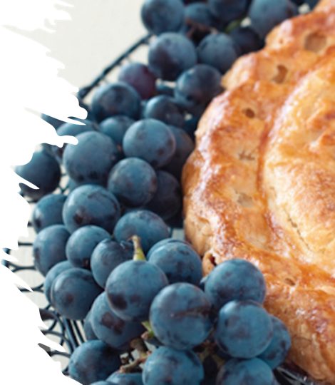

# Graph neural network using Protein-protein-interaction for Enhancing Protein Identification (Grape-Pi)

## Introduction
GRAph-neural-network using Protein-protein-interaction for Enhancing Protein Identification (Grape-Pi) is a deep 
learning framework for predict protein existence based on
protein feature generated from Mass spectrometry (MS) instrument/analysis software and protein-protein-interaction (PPI)
network.

The main idea is to  promote proteins with medium evidence but are supported by protein-protein-interaction information
as existent. Unlike traditional network analysis, PPI information is used with strong assumptions and restricted to
specific sub-network structures (e.g. clique), Grape-Pi model is a fully data-driven model and can be much more versatile. 

--------------------------------------------------------------------------------

The contribution of Grape-Pi comes in threefold. First, we developed a dataloader module designed for loading MS protein
data and protein-protein-interaction data into dataset format that can be readily used by torch-geometry.
Second, we customized the graphgym module for the purpose of unsupervised learning in proteomics data. Third, we explored
the design space and discussed caveats for training such a model for the best performance.


## installation

It consists of various methods for deep learning on graphs and other irregular structures, also known as *[geometric deep learning](http://geometricdeeplearning.com/)*, from a variety of published papers.
In addition, it consists of easy-to-use mini-batch loaders for operating on many small and single giant graphs, [multi GPU-support](https://github.com/pyg-team/pytorch_geometric/tree/master/examples/multi_gpu), [`DataPipe` support](https://github.com/pyg-team/pytorch_geometric/blob/master/examples/datapipe.py), distributed graph learning via [Quiver](https://github.com/pyg-team/pytorch_geometric/tree/master/examples/quiver), a large number of common benchmark datasets (based on simple interfaces to create your own), the [GraphGym](https://pytorch-geometric.readthedocs.io/en/latest/advanced/graphgym.html) experiment manager, and helpful transforms, both for learning on arbitrary graphs as well as on 3D meshes or point clouds.
[Click here to join our Slack community!][slack-url]

Please refer to https://conda.io/projects/conda/en/latest/user-guide/install/index.html for how to install a miniconda
or anaconda in your local machine.

To create a virtual environment, for example, if using conda
```angular2html
conda create -n [Name-of-the-Virtual-Environment] python=3.10
conda activate [Name-of-the-Virtual-Environment]
```
Replace `[Name-of-the-Virtual-Environment]` with your preferred name.

The original torch-geometry support python 3.7-3.11 with pytorch 1.3.0-2.0.0. For illustration
purpose, we use python=3.7 and pytorch=1.13.0 here. 
For using and debugging with other python and pytorch version, please refer to https://github.com/pyg-team/pytorch_geometric for details

In case you have accidentally an official version of torch-geometric, run
```angular2html
pip uninstall torch-geometric
pip uninstall torch-geometric  # run this command twice
```

### Install pytorch
For mac
```angular2html
conda install pytorch==2.0.0 torchvision==0.15.0 torchaudio==2.0.0 -c pytorch
```
For Linux and Windows:
```angular2html
# CUDA 11.7
conda install pytorch==2.0.0 torchvision==0.15.0 torchaudio==2.0.0 pytorch-cuda=11.7 -c pytorch -c nvidia
# CUDA 11.8
conda install pytorch==2.0.0 torchvision==0.15.0 torchaudio==2.0.0 pytorch-cuda=11.8 -c pytorch -c nvidia
# CPU Only
conda install pytorch==2.0.0 torchvision==0.15.0 torchaudio==2.0.0 cpuonly -c pytorch
```

### Follow the installation instructions to install additional libraries to using Grape-Pi:
torch-scatter, torch-sparse, torch-cluster and torch-spline-conv (if you haven't already):
```angular2html
pip install pyg_lib torch_scatter torch_sparse torch_cluster torch_spline_conv -f 
https://data.pyg.org/whl/torch-2.0.0+${CUDA}.html
```
If you are using pytorch=2.0.0 cpu only version, run
```angular2html
pip install torch_scatter torch_sparse torch_cluster torch_spline_conv -f https://data.pyg.org/whl/torch-2.0.0+cpu.html
```

Caution:
torch_geometry is not a easy-installed package/environment. If you have any issue while using it after updating some
of the package, try re-create new virtual environment and start from scratch and follow the instruction for that version
of torch_geometry.


### Clone a copy of Grape-Pi from source and navigate to the root directory of the download folder
```angular2html
git clone https://github.com/FDUguchunhui/Grape-Pi.git
cd Grape-Pi
```

## Install Grape-Pi in editable mode:

```angular2html
pip install -e ".[dev,full]"
```

## Data preparation
The Graph-Pi training framework was based on graphgym. Please check `Design Space for Graph Neural Networks 
https://arxiv.org/abs/2011.08843` for details.

The Graph-Pi framework features a built-in module for easily load raw protein and PPI data into torch.geometry.dataset 
format that can be used for training model. The only things needed is to provide a path to the dataset
folder.

The dataset folder structure should look like this, with a sub-folder named `raw`
inside the `raw` sub-folder, it should have three sub-folders: protein, interaction, reference.

The `protein` folder must contain only one csv or tsv file: the first column must be protein ID and other columns
contains additional protein features.

The `interaction` folder must contain only one csv or tsv file: the first and second columns must be same type protein ID,
refer to the two protein interactors, other columns can be additional features for the interaction relationship.

The `reference` folder must contain two txt files. 
`positive.txt` and `negative.txt` are two simple txt file with a protein ID in each line.
The protein in `positive.txt` will be used to create positive label in the final processed dataset
The protein in `negative.txt` will be used to create negative label in the final processed dataset.
Protein that is not found in either `positive.txt` and `negative.txt` will be treated as unlabelled.
Only labelled proteins will be used for calculating loss and then backward propagation to update model.

You could find such an example of such dataset `Graph-Pi/graphgym/data/yeast`

## Installation

PyG is available for Python 3.7 to Python 3.10.


## Set up model configuration
Before you can train a model based on the provided data, a configuration file is needed to for some key information:
where to find the data, how to parse the data, what features to use, model structure, what loss function to use, how to 
update model weights, etc. 

You could find such an example of such config `Graph-Pi/graphgym/config/protein/protein-yeast-graphsage.yaml`

```ymal
out_dir: results # output will be put in graphgym/results
metric_best: auc # best model will be selected based on what
dataset: # need to delete the `processed` folder if change args under dataset category
  name: protein # specify what dataloader used
  dir: ./data/yeast
  numeric_params: # currently, only numeric protein features are allowed
  - protein probability
  - percent coverage
  - tot indep spectra
  - percent share of spectrum ids
  task: node
  task_type: classification
  transductive: false
  transform: none
  encoder: false
  node_encoder: false
  edge_encoder: false
  split: [0.8, 0.1, 0.1]
share:
  dim_in: -1      # `-1` means the input dim will be determined automatically
  dim_out: 2
train:
  loss_pos_weight: -1.0  # `-1` means sample will be automatically rebalanced using sklearn.utils.class_weight.compute_class_weight
  batch_size: 128 # number of nodes used in each iteration
  eval_period: 10 # evaluate model in val and test dataset every 10 epochs
  ckpt_period: 10 # save model after every 10 epochs training
  ckpt_clean: false
  sampler: neighbor # use `neighor` for sampler for layer_type=sageconv
  neighbor_sizes: # the number of nodes sampled in each neighor level
  - 100
  - 50
  - 25
  - 10
  epoch_resume: -1
model:
  type: gnn
  loss_fun: binary_cross_entropy_with_weight
gnn:
  layers_pre_mp: 1
  layers_mp: 2
  layers_post_mp: 1
  dim_inner: 8 # 2 * dim_in
  layer_type: sageconv
  stage_type: stack # other available: skipsum, skipconcat
  batchnorm: false
  act: relu
  dropout: 0.0
  normalize_adj: false
  head: protein
optim:
  optimizer: adam
  base_lr: 0.001
  weight_decay: 5e-4  # L2 penalty
  max_epoch: 100
  scheduler: none
```

### Pip Wheels

We alternatively provide pip wheels for all major OS/PyTorch/CUDA combinations, see [here](https://data.pyg.org/whl).

#### PyTorch 1.13

To install the binaries for PyTorch 1.13.0, simply run

```
pip install pyg_lib torch_scatter torch_sparse -f https://data.pyg.org/whl/torch-1.13.0+${CUDA}.html
pip install torch_geometric
```

During the programming first running, a new "processed" folder will create under the provided data folder which stores the
converted torch_geometry.data.dataset format and additional processed files. This allows a one-time processing and the 
next time data the same data is used, the processed file will be loaded directly to save time.

**Caution**: In case you have updated the raw files, you need to manually deleted the entire `processed` folder to let the program
rebuild processed data from modified raw files.

For additional but optional functionality, run

```
pip install torch_cluster torch_spline_conv -f https://data.pyg.org/whl/torch-1.13.0+${CUDA}.html
```

CONFIG=${CONFIG:-protein-yeast-gcnconv}
GRID=${GRID:-protein-yeast-gcnconv}
REPEAT=${REPEAT:-3}
MAX_JOBS=${MAX_JOBS:-1}
SLEEP=${SLEEP:-0}
MAIN=${MAIN:-main}

In case you want to experiment with the latest PyG features which are not fully released yet, ensure that `pyg_lib`, `torch_scatter` and `torch_sparse` are installed by [following the steps mentioned above](#pip-wheels), and install either the **nightly version** of PyG via

```
The instruction above only aim to provide a start point for user to check how we did our experiment.
Please refer to https://github.com/snap-stanford/GraphGym for more details about how to config a batch experiment.

### run batch experiment
```angular2html
bash run_batch_yeast_gcnconv.sh
```


### Aggregate results
Run `bash run_batch_yeast_gcnconv.sh` should automatically aggregate batch experiment result into `agg` folder.
However, in case it is not generated automatically, you can manually aggregate the results by run
```angular2html 
python agg_batch.py --dir results/protein-yeast-graphsage_grid_protein-yeast-graphsage
```


## Post-training analysis


## Rebuild the best model based on analysis result from batch experiment for protein prediction application 
```angular2html

```


## Cite
Please cite the following papers if you use this code in your own work::
[Fast Graph Representation Learning with PyTorch Geometric


[Fast Graph Representation Learning with PyTorch Geometric
](https://arxiv.org/abs/1903.02428) 

```
@inproceedings{Fey/Lenssen/2019,
  title={Fast Graph Representation Learning with {PyTorch Geometric}},
  author={Fey, Matthias and Lenssen, Jan E.},
  booktitle={ICLR Workshop on Representation Learning on Graphs and Manifolds},
  year={2019},
}
```


Common issues:

1. If you have the following problem during processing the `raw` data into `processed` data
```angular2html
utf8' codec can't decode byte 0x80 in position 3131: invalid start byte
```
This is caused by a hidden `.DS_Store` file created by the Mac OS system
Use terminal enter the `protein` folder under the `raw` folder
```angular2html
ls -a # check if there is a .DS_Store file
rm .DS_Store # remove the file
rm -r ../../processed # remove the ill-created `processed` data
```

Mac user
```angular2html
UserWarning: An issue occurred while importing 'pyg-lib'. Disabling its usage. Stacktrace: dlopen(/Users/guchunhui/opt/anaconda3/envs/Grape-Pi/lib/python3.10/site-packages/libpyg.so, 0x0006): Library not loaded: '/Users/runner/hostedtoolcache/Python/3.10.8/x64/lib/libpython3.10.dylib'
  Referenced from: '/Users/guchunhui/opt/anaconda3/envs/Grape-Pi/lib/python3.10/site-packages/libpyg.so'
  Reason: tried: '/Users/runner/hostedtoolcache/Python/3.10.8/x64/lib/libpython3.10.dylib' (no such file), '/usr/local/lib/libpython3.10.dylib' (no such file), '/usr/lib/libpython3.10.dylib' (no such file)
  warnings.warn(f"An issue occurred while importing 'pyg-lib'. "
```


```angular2html
pip uninstall pyg_lib torch_scatter torch_sparse torch_cluster torch_spline_conv -f https://data.pyg.org/whl/torch-2.0.0+cpu.html
```

https://stackoverflow.com/questions/71728145/problem-with-python-pil-dylib-and-compatibility-with-macos
